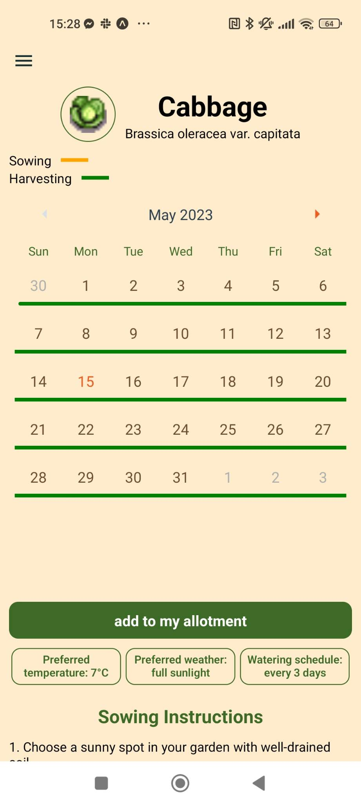
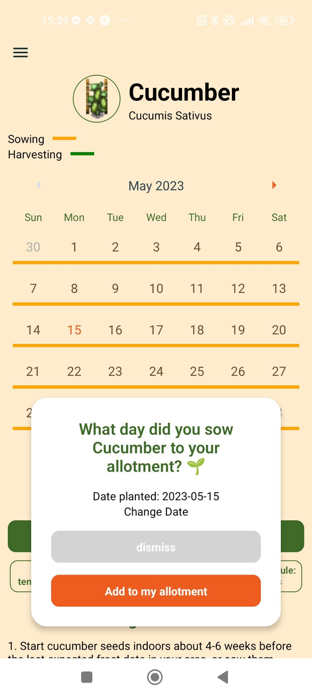
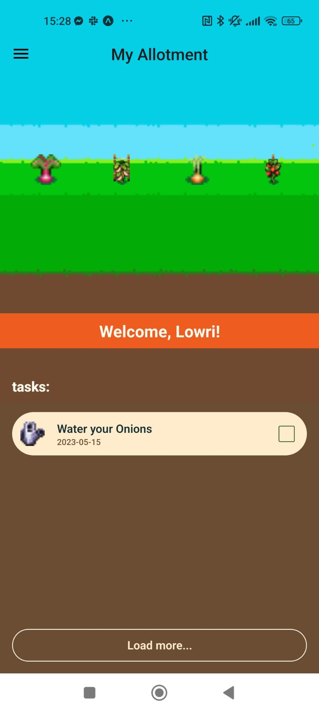
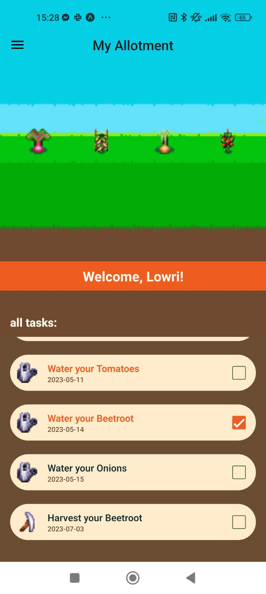
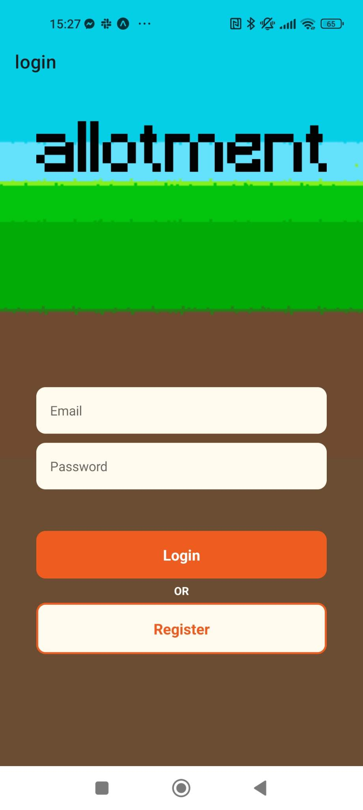
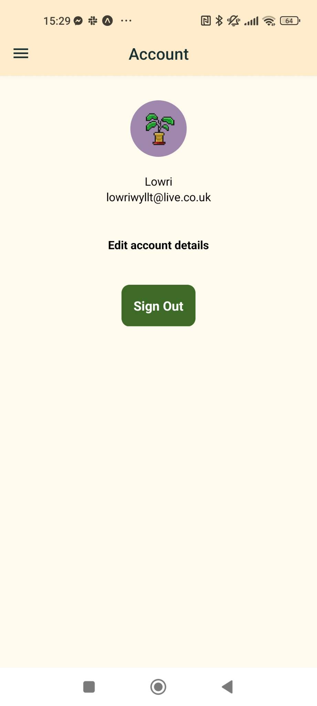
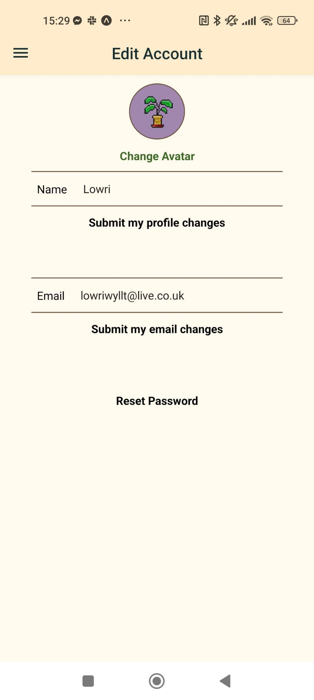

# Allotment

Welcome to the Allotment app repository! This app is designed to help people who want to grow their own vegetables but don't know where to start. By bringing together various resources, our app aims to make it easier for you to begin your gardening journey. Allotment allows you to grow virtual vegetables alongside the ones in your physical allotment, providing you with a list of tasks to keep your plants happy and thriving.

This was my final project at Northcoders (05/2023). This was made by my team [Peter Matthews](https://github.com/PeterM24), [Lily Levin](https://github.com/LpgLevin), [Connor Smith](https://github.com/connorwriter), [Ryan Karakoc](https://github.com/RyanKarakoc) and [Ross Hamilton](https://github.com/HamRoss).

## Installation

To use Allotment, you'll need an emulator on your local machine such as [Android Studio Emulator](https://docs.expo.dev/workflow/android-studio-emulator/), [Xcode](https://docs.expo.dev/workflow/ios-simulator/). Alternatively, you can download Expo Go from [Google Play](https://play.google.com/store/apps/details?id=host.exp.exponent&referrer=www) or the [App Store](https://itunes.apple.com/app/apple-store/id982107779).

To install this repository locally, follow these steps :

1. Move to the directory where you want to store this repository locally.
2. Clone this repository to your local machine using the following command :

```
git clone https://github.com/lowriwyllt/allotment.git
```

3. Navigate to the repository's directory:

```
cd allotment
```

4. Run `npm install` to download all the dependencies.
5. Run `npm start`
6. Then follow the instructions in the terminal to get the app running on your emulator or phone

## Features

Our allotment app allows you to add the vegetables you have growing in your physical allotment to a virtual allotment. When adding a plant, you provide the date you planted it, and the app automatically generates tasks for you to complete, such as watering and harvesting.

### Plants

The Plants page provides you with a variety of vegetables. By clicking on a specific plant, you can access its dedicated page, which contains detailed information about the plant. This includes watering frequency, sunlight requirements, and the minimum temperature preferred by the plant. Additionally, the page displays a calendar indicating the optimal sowing and harvesting windows. From this page, you can add the plant to your virtual allotment or remove it if you've already added it.

<div>
  

</div>
  
### My Virtual Allotment
The My Virtual Allotment page is your personalised space that displays the plants you have growing in your virtual allotment. It also provides a list of tasks you need to complete on a given day to ensure your plants remain healthy. By clicking on any of the plants in your allotment, you can access their dedicated pages to view all the plant details. On this page, you can tick off completed tasks, and by clicking "load more," you can view tasks scheduled for future days.

<div>

  
</div>

### Account

Upon registration, you'll need to provide an email, name, avatar, and password. The Account page allows you to manage your account settings, including editing your profile information. You can update your email, name, and avatar as needed. You can also request to change your password which will send you an email to change your password.

<div>


  
</div>

## Technologies

The Allotment app is built using the following technologies :

- **Planning and originisation:** We used Trello, Git and GitHub to keep our code and tasks organised.

  -  Trello: A project management tool for organizing tasks and workflows.
  -  Git: A version control system for tracking changes in code.
  -  GitHub: A web-based hosting service for Git repositories.

- **Programming:** This app is built using the following tech stack:
  -  TypeScript: A typed superset of JavaScript that compiles to plain JavaScript.
  -  Visual Studio Code: A lightweight and powerful code editor.
  -  React: A JavaScript library for building user interfaces.
  -  Firebase: A comprehensive platform for building web and mobile applications.
  -  React Native: A framework for building mobile applications using React.
  -  Expo: An open-source platform for building and deploying universal native apps.

These technologies were chosen for their effectiveness in developing a cross-platform mobile app with a smooth user experience. TypeScript provides type checking and enhances code reliability. React Native and Expo enable us to build and deploy the app on both Android and iOS devices. Firebase provides backend services, including authentication and database management, for seamless app functionality.
